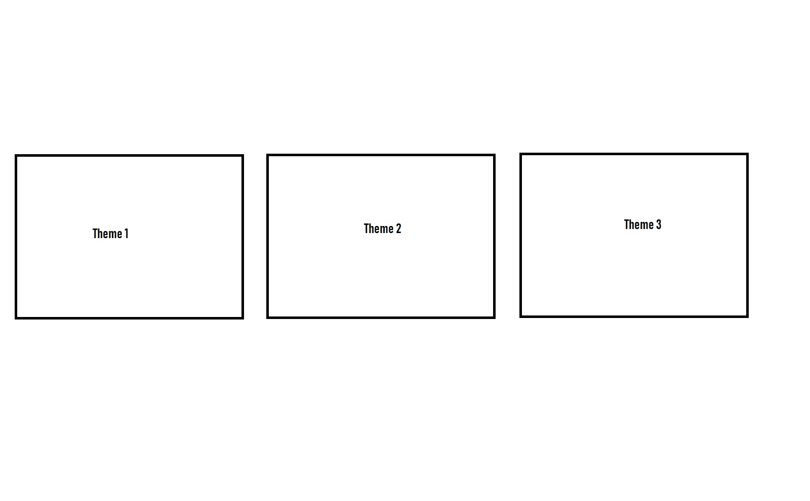
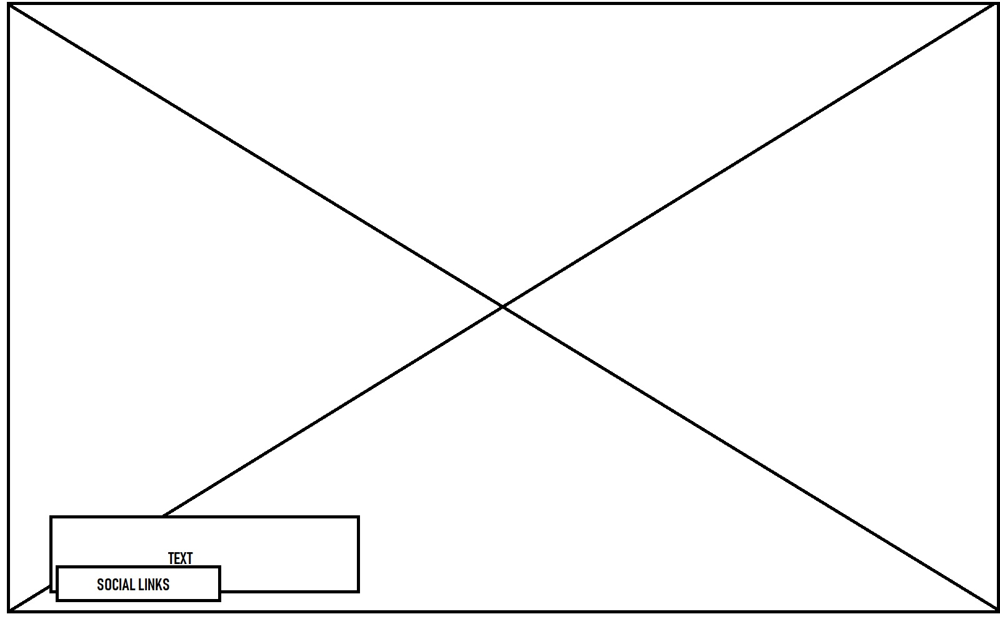

# Ewan Lockwood Templates

#### Site Address: https://ewanlockwood-templates.herokuapp.com/

-----

## Table of Contents

1. [Overview](#overview)

2. [UX Design Procedure](#ux)
    - [Strategy Plane](#strategy-plane)
    - [Scope Plane](#scope-plane)

3. [Features](#features)
    - [Existing Features](#existing-features)
    
4. [Technologies Used](#technologies-used)

5. [Testing](#testing)

6. [Deployment](#deployment)

7. [Credits](#credits)

-----

## Overview

This is a full-stack web application that uses a centrally-owned dataset where
users can buy website templates from the site through the Stripe payment api. It
has 3 themes to choose from: Ocean, Forest and Desert.

-----


## UX

## Strategy Plane

The purpose of this web application is to provide a site that offers services to
help myself sell website templates to clients.

## Scope Plane

As the website only has a singular function, to show products, I chose to create one page to
enhance user experience.

## Structure Plane

I drafted a rough Idea of the layout of my site using Microsoft Paint to act as a foundation for my site.





## Interaction Design
The menus at the top left of the screen create an easier way for the user to navigate through the site.

## Surface Plane

The main font is Joesefin Sans.

The color scheme I chose for this project is seen below:

##ff620d ( Main color of the website )
#21D159 ( Button Success )

### Development

#### IDE
AWS Cloud9 IDE was the Integrated development enviroment for this website.

#### Version Control
Git Hub was the version control station for this website which was used to manage and store versions of the source code.

### Heroku 
Heroku was the PaaS that enabled me to build and run my application.

-----
## Features


### Existing Features

 1. Users can purchase any of the three themes
 2. Mobile Responsive

-----

## Technologies Used


### HTML
To provide the structure of the webiste.

### CSS
To make the website look better visually.

### Javascript
Boostrap functionality.

### Jquery
Entirely to enable bootstrap functions with navbar expanding.

### Bootstrap (https://getbootstrap.com/)
To use their responsive grid system and also their sass variables where certain variables have an established design to it already.

### Python
To import require modules to connect to Mongo.db and also to create the app using the flask module.

### Django
A Python Framework to help with the development of the web application.

### Stripe
A online software platform for e-commerce payments.

-----

## Testing

I tested this project manually.

 1. All buttons work on each menu.
 2. All social links work.
 3. Stripe test credit cards was good.
 4. User creation work.
 5. Mobile Responsive.

-----

## Deployment

The version control and deployment of this project is based on Git Hub. After every session I push the local code within AWS Cloud9 into my GIT HUB repository.


This is my procedure: 

After I have finished working on the files in my IDE I would open the terminal and do the following commands to push the updated files across to the repository on GitHub

``` $git add . ```

```$git commit -m "describe the stage I am at"```

```git push -u origin master```

I would now ```$git status``` to check if everything is finished and then look at the repository to see there aswell.

-----

## Credits
### Content
All Icons came from https://fontawesome.com/.
The main font was found at https://fonts.google.com/specimen/Releway.
### Media
The images I used were from Adobe Stock.
